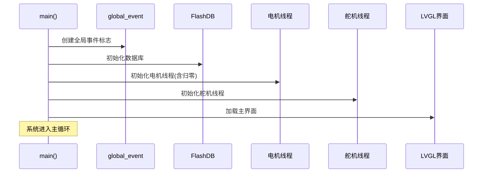
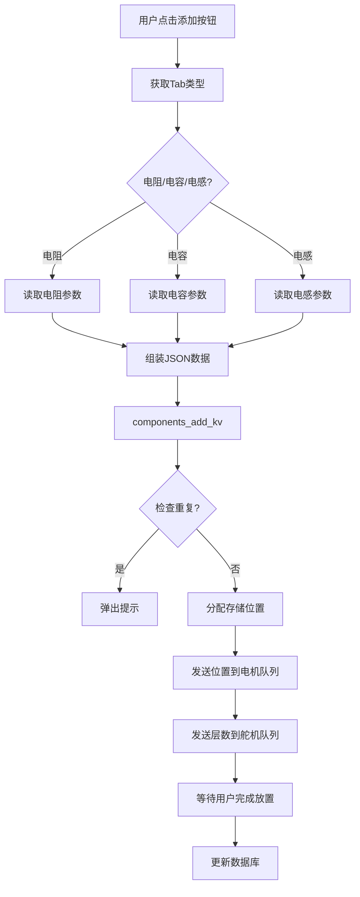
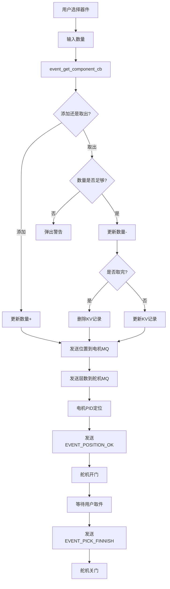
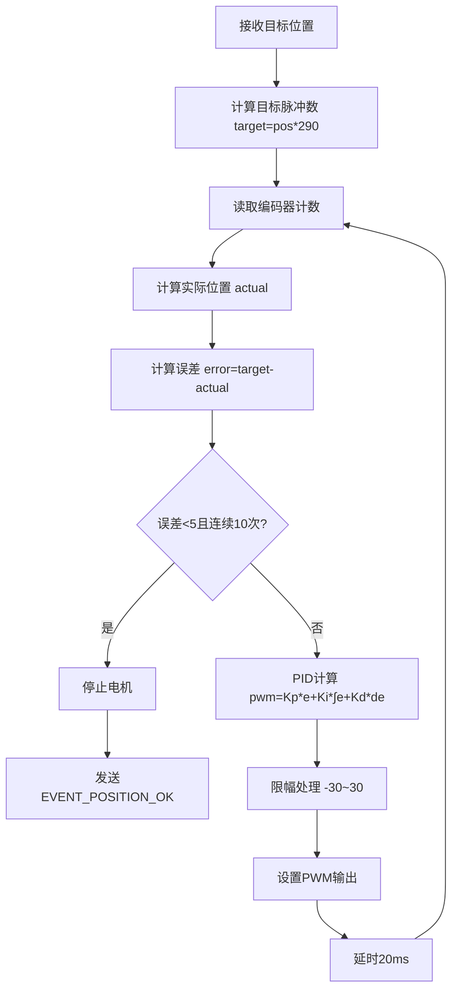

# 智能元器件收纳管家 - 项目技术文档

---

## 一、项目概述

### 1.1 项目名称

智能元器件收纳管家

### 1.2 项目简介

基于RT-Thread操作系统的智能电子元件存储管理系统，通过LVGL图形界面实现器件的添加、查找和取件功能，支持电机精确定位和舵机取件门控制。

### 1.3 功能特性

| 功能模块 | 功能描述 | 实现方式 |
| --- | --- | --- |
| 器件管理 | 添加、查找、删除电子元件 | FlashDB键值存储 |
| 位置定位 | 电机精确定位到指定位置 | PID算法控制 |
| 取件控制 | 控制舵机打开/关闭取件门 | PWM信号控制 |
| 可视化界面 | 触摸屏交互操作 | LVGL 8.3.11 |
| 数据持久化 | 器件信息断电保存 | FlashDB |

---

## 二、硬件配置表

### 2.1 核心硬件

| 硬件名称 | 型号/规格 | 数量  | 用途  | 备注  |
| --- | --- | --- | --- | --- |
| 主控芯片 | STM32H750XBHX | 1   | 系统控制核心 | ARM Cortex-M7 |
| AXI SRAM | 512KB | 1   | 高速运行内存 | 0x24000000 |
| SDRAM | 32MB | 1   | 大容量运行内存 | 0xC0000000 |
| 存储  | QSPI Flash 16MB | 1   | 程序存储 | 0x90000000 |
| 显示屏 | 800×480 TFT | 1   | 人机交互界面 | LVGL驱动 |
| 触摸屏 | 电容式触摸屏 | 1   | 触摸输入 | LVGL触摸驱动 |

### 2.2 电机控制模块

| 硬件名称 | 型号/规格 | 数量  | 用途  | 引脚/设备 |
| --- | --- | --- | --- | --- |
| 直流电机 | 带编码器电机 | 1   | 位置定位 | PWM15 CH2 |
| 脉冲编码器 | AB相编码器 | 1   | 位置反馈 | pulse3 |
| 霍尔传感器 | 磁性传感器 | 1   | 归零检测 | PA15 |
| L298N驱动板 | 电机驱动 | 1   | 电机驱动 | PH2, PH3 |

### 2.3 舵机控制模块

| 硬件名称 | 型号/规格 | 数量  | 用途  | PWM设备/通道 |
| --- | --- | --- | --- | --- |
| SG90舵机 | 9g舵机 | 3   | 取件门控制 | PWM4 CH4/CH3, PWM2 CH2 |

### 2.4 通信模块

| 硬件名称 | 型号/规格 | 数量  | 用途  | 引脚  |
| --- | --- | --- | --- | --- |
| UART1 | 串口通信 | 1   | 预留扩展 | PA9(TX), PA10(RX) |
| UART4 | 串口通信 | 1   | 控制台输出 | PA0(TX), PI9(RX) |
| UART6 | 串口通信 | 1   | 预留语音模块 | PC6(TX), PC7(RX) |
| Wi-Fi模块 | ESP32系列 | 1   | 网络连接(可选) | 预留  |

### 2.5 外设模块

| 硬件名称 | 型号/规格 | 数量  | 用途  | 引脚  |
| --- | --- | --- | --- | --- |
| 蜂鸣器 | 无源蜂鸣器 | 1   | 触摸反馈 | PG11 |
| LED0 | 指示灯 | 1   | 系统状态指示 | PI8 |

---

## 三、软件技术栈表

### 3.1 操作系统

| 组件  | 版本  | 用途  | 关键特性 |
| --- | --- | --- | --- |
| RT-Thread | 4.x | 嵌入式实时操作系统 | 线程管理、IPC机制、设备驱动 |
| RT-Thread Kernel | -   | 内核核心 | 线程、消息队列、事件标志 |
| Device Drivers | -   | 硬件驱动层 | PWM、UART、编码器、触摸屏 |

### 3.2 GUI框架

| 组件  | 版本  | 用途  | 关键特性 |
| --- | --- | --- | --- |
| LVGL | 8.3.11 | 图形界面库 | 控件丰富、动画效果、低内存占用 |
| SquareLine Studio | 1.5.1 | UI设计工具 | 可视化设计、代码生成 |

### 3.3 数据存储

| 组件  | 版本  | 用途  | 关键特性 |
| --- | --- | --- | --- |
| FlashDB | -   | 嵌入式数据库 | KV存储、blob存储、掉电保护 |
| cJSON | -   | JSON解析库 | 轻量级、内存友好 |

### 3.4 算法模块

| 算法  | 用途  | 参数配置 |
| --- | --- | --- |
| PID控制 | 电机精确定位 | Kp=0.35, Ki=0.05, Kd=0 |
| 脉冲计数 | 编码器位置检测 | 脉冲编码器pulse3 |
| 霍尔检测 | 电机归零 | 上升沿触发 |

---

## 四、模块功能表

### 4.1 电机控制模块

| 功能名称 | 实现函数 | 功能描述 | 参数说明 |
| --- | --- | --- | --- |
| 电机线程初始化 | `encoder_thread_init()` | 创建消息队列、打开设备、创建线程 | 无   |
| 电机PID控制 | `encodermotor_entry()` | PID位置闭环控制 | pos:目标位置 |
| PWM设置 | `motor_set_pwm()` | 设置电机PWM值和方向 | pwm_val: -100~100 |
| 电机归零 | `motor_zero_out()` | 霍尔传感器归零 | 无   |

### 4.2 舵机控制模块

| 功能名称 | 实现函数 | 功能描述 | 参数说明 |
| --- | --- | --- | --- |
| 舵机线程初始化 | `servo_thread_init()` | 创建消息队列、打开设备、创建线程 | 无   |
| 舵机控制 | `servo_trhread_entry()` | 根据层数控制对应舵机 | layer: 0/1/2 |
| 舵机开门/关门 | `rt_pwm_set()` | 设置舵机PWM脉冲宽度 | 打开/关闭脉冲值 |

### 4.3 蜂鸣器模块

| 功能名称 | 实现函数 | 功能描述 | 参数说明 |
| --- | --- | --- | --- |
| 蜂鸣器线程初始化 | `buzzer_thread_init()` | 设置引脚模式、创建线程 | 无   |
| 蜂鸣器控制 | `buzzer_thread_entry()` | 触摸屏幕时发声反馈 | EVENT_TOUCH_SCREEN触发 |

### 4.5 数据存储模块

| 功能名称 | 实现函数 | 功能描述 | 参数说明 |
| --- | --- | --- | --- |
| 数据库初始化 | `database_init()` | 初始化FlashDB | 无   |
| 添加器件 | `components_add_kv()` | 添加器件到数据库 | jsoninfo: JSON信息, quantity:数量 |
| 查找器件 | `components_find_kv()` | 根据条件查找器件 | filter: 筛选条件 |

### 4.6 GUI界面模块

| 功能名称 | 界面文件 | 功能描述 |
| --- | --- | --- |
| 主界面 | `ui_Screenmain` | 显示标题和系统状态 |
| 添加界面 | `ui_Screenadd` | 添加电阻/电容/电感信息 |
| 查找界面 | `ui_Screenfind` | 按条件查找器件 |
| 取件操作 | `event_get_component_cb()` | 触发取件流程 |
| 添加操作 | `addBTN_call_function()` | 执行添加器件 |
| 查找操作 | `findBTN_call_function()` | 执行查找器件 |

---

## 五、引脚定义表

### 5.1 UART引脚

| UART | TX引脚 | RX引脚 | 用途  |
| --- | --- | --- | --- |
| UART1 | PA9 | PA10 | 预留扩展 |
| UART4 | PA0 | PI9 | 控制台输出 |
| UART6 | PC6 | PC7 | 预留语音模块 |

### 5.2 电机控制引脚

| 功能  | 引脚  | 方向  | 用途  |
| --- | --- | --- | --- |
| MOTOR_IN1 | PH2 | 输出  | 电机方向控制 |
| MOTOR_IN2 | PH3 | 输出  | 电机方向控制 |
| HALL_PIN | PA15 | 输入(上拉) | 归零检测 |

### 5.3 PWM设备映射

| PWM设备 | 通道  | 用途  | 频率/周期 |
| --- | --- | --- | --- |
| pwm15 | CH2 | 电机驱动 | 1ms(1000000ns) |
| pwm4 | CH4 | 舵机1控制 | 20ms(20000000ns) |
| pwm4 | CH3 | 舵机2控制 | 20ms(20000000ns) |
| pwm2 | CH2 | 舵机3控制 | 20ms(20000000ns) |

### 5.4 编码器设备

| 设备名称 | 用途  | 计数模式 |
| --- | --- | --- |
| pulse3 | 脉冲编码器 | AB相计数 |

### 5.5 外设引脚

| 功能  | 引脚  | 方向  | 用途  |
| --- | --- | --- | --- |
| BUZZER_PIN | PG11 | 输出  | 蜂鸣器控制 |
| LED0_PIN | PI8 | 输出  | 系统状态指示灯 |

---

## 六、工作流程图

### 6.1 系统启动流程



### 6.2 添加器件流程



### 6.3 取件流程



### 6.4 电机PID控制流程



---

## 七、通信协议表

### 7.1 线程间通信

| 通信方式 | 名称  | 数据类型 | 用途  |
| --- | --- | --- | --- |
| 消息队列 | motor_mq | uint8_t | 传递目标位置(0-11) |
| 消息队列 | servo_mq | uint8_t | 传递目标层数(0-2) |
| 事件标志 | global_event | rt_uint32_t | 线程同步信号 |

### 7.2 事件标志定义

| 事件名称 | 位掩码 | 触发时机 |
| --- | --- | --- |
| EVENT_PICK_FINNISH | 1 << 2 | 用户完成取件操作 |
| EVENT_POSITION_OK | 1 << 3 | 电机定位完成 |
| EVENT_TOUCH_SCREEN | 1 << 4 | 触摸屏被触摸 |
| EVENT_ZERO_OK | 1 << 5 | 电机归零完成 |

### 7.3 JSON数据格式

**器件信息JSON格式：**

| 字段名 | 类型  | 含义  | 示例  |
| --- | --- | --- | --- |
| type | string | 器件类型 | "Resistor"/"Capacitor"/"Inductor" |
| val | string | 器件值 | "10k"/"100n"/"10u" |
| pkg | string | 封装类型 | "0603"/"0805"/"1206" |
| rated val | string | 额定值 | "1/4W"/"6.3V"/"1A" |
| accuracy | string | 精度/容差 | "5%"/"10%"/"J" |
| other | string | 其他信息 | "贴片"/"直插" |

**示例：**

```json
{
    "type": "Resistor",
    "val": "10k",
    "pkg": "0603",
    "rated val": "1/4W",
    "accuracy": "5%",
    "other": "贴片"
}
```

---

## 八、数据存储结构表

### 8.1 器件信息结构

| 字段名 | 类型  | 大小  | 描述  |
| --- | --- | --- | --- |
| para_info | char[] | MAX_COMPONENT_INFO_LEN | JSON格式的器件参数 |
| quantity | uint32_t | 4 bytes | 器件数量 |

### 8.2 筛选条件结构

| 字段名 | 类型  | 大小  | 描述  |
| --- | --- | --- | --- |
| type | char[] | MAX_FILTER_INFO_LEN(16) | 器件类型筛选 |
| val | const char* | 4 bytes(指针) | 器件值筛选(指向LVGL控件) |
| package | const char* | 4 bytes(指针) | 封装筛选(指向LVGL控件) |
| ratedval | const char* | 4 bytes(指针) | 额定值筛选(指向LVGL控件) |
| tolerance | const char* | 4 bytes(指针) | 精度筛选(指向LVGL控件) |
| otherinfo | const char* | 4 bytes(指针) | 其他信息筛选(指向LVGL控件) |

### 8.3 存储布局

| 存储位置 | Key格式 | Value类型 | 容量  |
| --- | --- | --- | --- |
| FlashDB | "00"-"35" | component_info | 36个器件 |
| FlashDB | "boot_count" | uint16_t | 启动计数 |

---

## 九、系统架构图

系统架构图已集中到专门的架构文档中，包含以下图表：

| 图表名称 | 描述  |
| --- | --- |
| 硬件架构图 | ART-PI开发板硬件组成及外部设备连接 |
| 软件架构图 | 驱动层、操作系统层、中间件层、应用层层次结构 |
| 电源架构图 | 12V/5V/3.3V电源分配方案 |
| 软件模块交互图 | 各模块间的时序交互关系 |
| 数据流程图 | 数据从输入到输出的完整流程 |
| 线程调度与通信图 | 线程优先级及IPC通信机制 |
| 硬件连接示意图 | 详细的引脚连接关系 |
| 存储架构图 | FlashDB存储布局及数据结构 |
| 取件流程时序图 | 取件操作的详细时序 |
| 系统整体架构全景图 | 系统各层次的完整连接关系 |

**详细架构图请参考**：[SYSTEM_ARCHITECTURE.md](SYSTEM_ARCHITECTURE.md)

---

## 十、关键参数配置

### 10.1 PID控制参数

| 参数  | 值   | 说明  |
| --- | --- | --- |
| Kp  | 0.35 | 比例系数 |
| Ki  | 0.05 | 积分系数 |
| Kd  | 0   | 微分系数 |
| 控制周期 | 20ms | PID计算间隔 |
| 位置阈值 | 5脉冲 | 定位精度 |
| PWM限幅 | -30~30 | 输出限制 |

### 10.2 位置映射

| 位置编号 | 位置索引(pos) | 层数(layer) | 脉冲数(target) |
| --- | --- | --- | --- |
| 00-11 | 0-11 | 0   | 0-3190 |
| 12-23 | 0-11 | 1   | 0-3190 |
| 24-35 | 0-11 | 2   | 0-3190 |

**计算公式：** `target = pos × 290`

### 10.3 舵机PWM参数

| 舵机  | 开门脉冲 | 关门脉冲 | PWM设备/通道 |
| --- | --- | --- | --- |
| 舵机1(第1层) | 1625000ns | 500000ns | pwm4/CH4 |
| 舵机2(第2层) | 500000ns | 1625000ns | pwm4/CH3 |
| 舵机3(第3层) | 500000ns | 1625000ns | pwm2/CH2 |

**周期：** 20000000ns (20ms)

---

## 十一、文件结构

```
applications/
├── Gui/                    # GUI界面模块
│   ├── screens/
│   │   ├── ui_Screenmain.c    # 主界面
│   │   ├── ui_Screenadd.c     # 添加界面
│   │   └── ui_Screenfind.c    # 查找界面
│   ├── components/
│   ├── fonts/
│   ├── ui.c                  # UI入口
│   ├── ui.h
│   ├── ui_events.c           # 事件处理
│   └── ui_helpers.c          # 辅助函数
├── motor/                   # 电机控制模块
│   └── encoder_motor.c       # 编码器电机控制
├── servo/                   # 舵机控制模块
│   └── servo.c               # 舵机控制
├── DataBase/                # 数据存储模块
│   ├── database.c            # FlashDB实现
│   └── database.h            # 数据结构定义
├── buzzer/                  # 蜂鸣器模块
│   └── buzzer.c              # 蜂鸣器控制
├── pv_event.h               # 全局事件定义
└── main.c                   # 系统主入口
```

---

## 十二、扩展功能建议

### 12.1 语音交互功能

| 扩展项 | 方案  | 硬件需求 |
| --- | --- | --- |
| 语音识别 | LD3320本地识别 / ESP32S3云端AI | LD3320模块 / ESP32S3开发板 |
| 语音合成 | SYN6288 | SYN6288模块 |
| 通信接口 | UART6 | PC6(TX), PC7(RX) |

### 12.2 网络功能

| 扩展项 | 方案  | 硬件需求 |
| --- | --- | --- |
| Wi-Fi连接 | ESP32S3透传 | ESP32S3开发板 |
| 远程控制 | MQTT协议 | 网络模块 |
| 数据同步 | 云端数据库 | 网络模块 |

### 12.3 传感器扩展

| 扩展项 | 方案  | 硬件需求 |
| --- | --- | --- |
| 温湿度监测 | DHT11/DHT22 | 温湿度传感器 |
| 光照检测 | BH1750 | 光照传感器 |
| 人体感应 | HC-SR501 | 红外传感器 |

---

**文档版本**：V1.0  
**创建日期**：2026-06-29  
**项目类型**：嵌入式智能存储系统  
**运行平台**：ART-PI (STM32H750) + RT-Thread
