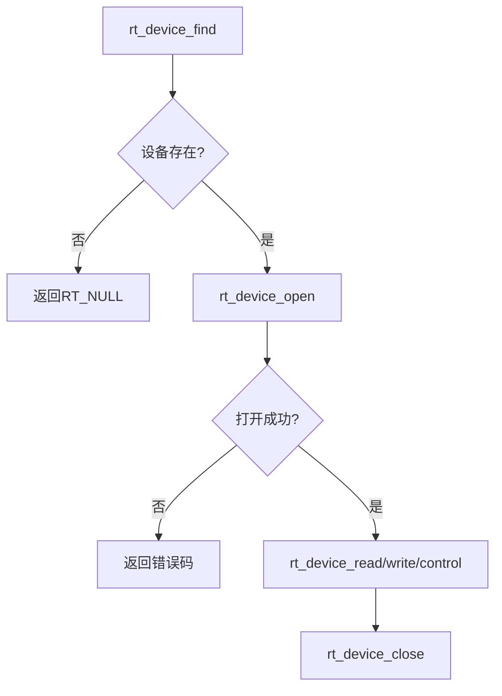
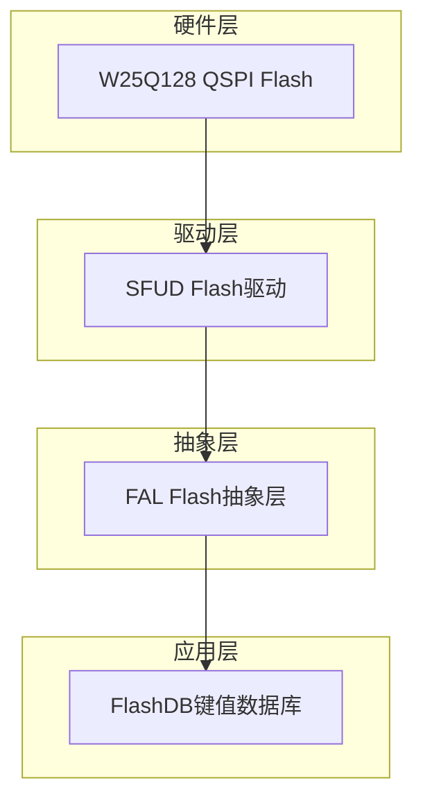
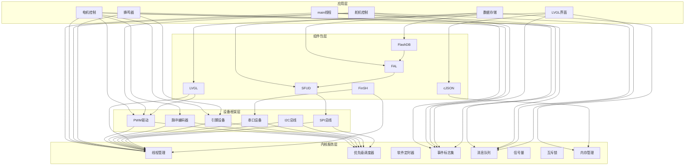
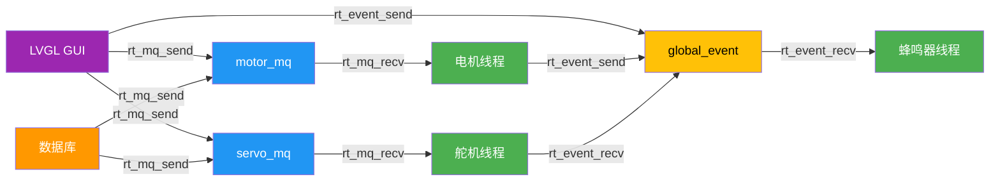

# RT-Thread 技术细节深度解析

---

## 1. 内核配置与调度

### 1.1 内核核心配置参数

从 `.config` 文件提取的关键内核配置：

| 配置项 | 值 | 技术含义 |
|--------|-----|---------|
| `CONFIG_RT_THREAD_PRIORITY_32` | `y` | 支持32级线程优先级 |
| `CONFIG_RT_THREAD_PRIORITY_MAX` | `32` | 优先级范围：0~31（数值越小优先级越高） |
| `CONFIG_RT_TICK_PER_SECOND` | `1000` | 系统时钟频率1kHz，tick周期1ms |
| `CONFIG_RT_TIMER_THREAD_PRIO` | `4` | 软件定时器线程优先级（最高优先级之一） |
| `CONFIG_RT_TIMER_THREAD_STACK_SIZE` | `512` | 软件定时器线程栈大小 |
| `CONFIG_IDLE_THREAD_STACK_SIZE` | `256` | 空闲线程栈大小 |

### 1.2 调度策略分析

RT-Thread采用**抢占式优先级调度**策略：

```
优先级排序：0(最高) → 31(最低)
├── priority:4   → 软件定时器线程(timer)
├── priority:10  → 主线程(main)、电机控制线程(motor)
├── priority:11  → 舵机控制线程(servo)
├── priority:20  → 蜂鸣器线程(buzzer)、FinSH线程(tshell)、LVGL线程(lvgl)
└── priority:31  → 空闲线程(idle)
```

**优先级设计合理性分析**：

- **motor线程(priority:10)**：电机PID控制需要较高实时性，优先级高于舵机
- **servo线程(priority:11)**：舵机控制依赖电机定位完成，优先级稍低合理
- **buzzer线程(priority:20)**：蜂鸣器反馈为低优先级任务，不影响核心控制
- **FinSH/LVGL线程(priority:20)**：人机交互和调试工具，低优先级运行

---

## 2. 线程模型

### 2.1 系统线程全景表

| 线程名称 | 入口函数 | 优先级 | 栈大小 | 时间片 | IPC资源 | 核心职责 |
|---------|---------|--------|--------|--------|---------|---------|
| `main` | `main()` | 10 | 2048 | - | global_event | 系统初始化、LED心跳 |
| `motor` | `encodermotor_entry()` | 10 | 1024 | 10 | motor_mq, global_event | 电机PID闭环控制 |
| `servo` | `servo_trhread_entry()` | 11 | 512 | 10 | servo_mq, global_event | 舵机开关控制 |
| `buzzer` | `buzzer_thread_entry()` | 20 | 256 | 5 | global_event | 触摸蜂鸣反馈 |
| `tshell` | FinSH内置 | 20 | 4096 | - | - | 命令行调试接口 |
| `lvgl` | LVGL内置 | 20 | 4096 | - | - | 图形界面渲染 |
| `timer` | RT-Thread内置 | 4 | 512 | - | - | 软件定时器管理 |
| `idle` | RT-Thread内置 | 31 | 256 | - | - | 系统空闲处理 |

### 2.2 线程创建代码分析

**电机线程创建**（`encoder_motor.c:144-150`）：

```c
encoder_motor_thread = rt_thread_create("motor",
                                encodermotor_entry, RT_NULL,
                                1024, 10, 10);
```

| 参数 | 值 | 含义 |
|------|-----|------|
| name | `"motor"` | 线程名称，用于调试和内核对象查找 |
| entry | `encodermotor_entry` | 线程入口函数指针 |
| parameter | `RT_NULL` | 传递给入口函数的参数 |
| stack_size | `1024` | 栈大小（字节），用于局部变量和函数调用 |
| priority | `10` | 优先级（10为较高优先级） |
| tick | `10` | 时间片（tick数），同优先级线程轮转调度 |

**舵机线程创建**（`servo.c:106-111`）：

```c
servo_thread = rt_thread_create("servo",
                            servo_trhread_entry, RT_NULL,
                            512, 11, 10);
```

**设计考量**：舵机线程优先级(11)低于电机线程(10)，确保电机定位优先完成。

---

## 3. IPC机制深度剖析

### 3.1 消息队列

#### 3.1.1 消息队列配置

**motor_mq**（`encoder_motor.c:103`）：

```c
motor_mq = rt_mq_create("M_mq", sizeof(uint8_t), 5, RT_IPC_FLAG_PRIO);
```

**servo_mq**（`servo.c:87`）：

```c
servo_mq = rt_mq_create("S_mq", sizeof(rt_uint8_t), 5, RT_IPC_FLAG_PRIO);
```

| 参数 | 值 | 含义 |
|------|-----|------|
| name | `"M_mq"` / `"S_mq"` | 消息队列名称 |
| msg_size | `sizeof(uint8_t) = 1` | 单条消息大小（仅存储位置/层数索引） |
| max_msgs | `5` | 队列最大消息数（深度） |
| flag | `RT_IPC_FLAG_PRIO` | **优先级队列模式** |

#### 3.1.2 RT_IPC_FLAG_PRIO 语义

```
RT_IPC_FLAG_PRIO（优先级模式）vs RT_IPC_FLAG_FIFO（先进先出模式）

优先级模式下：
├── 高优先级线程发送的消息排在队列前端
├── 确保紧急任务优先处理
└── 适用于电机/舵机控制等实时场景

FIFO模式下：
├── 消息按发送顺序排队
└── 适用于普通数据传输
```

#### 3.1.3 消息收发流程

**发送消息**（`ui_events.c:100-101`）：

```c
rt_mq_send(motor_mq, &pos, sizeof(pos));        // 发送位置信息(0~11)
rt_mq_send(servo_mq, &level, sizeof(level));    // 发送层数信息(0~2)
```

**接收消息**（`encoder_motor.c:49`）：

```c
if(rt_mq_recv(motor_mq, &pos, sizeof(pos), RT_WAITING_FOREVER) == RT_EOK){
    target = pos * 290;  // 位置转脉冲数
}
```

| 参数 | 值 | 含义 |
|------|-----|------|
| mq | `motor_mq` | 消息队列句柄 |
| buffer | `&pos` | 接收缓冲区指针 |
| size | `sizeof(pos)` | 接收数据大小 |
| timeout | `RT_WAITING_FOREVER` | 永久阻塞等待 |

### 3.2 事件标志集

#### 3.2.1 事件定义

**事件标志位映射**（`pv_event.h`）：

```c
#define EVENT_PICK_FINNISH         (1 << 2)   // 0x04 - 取件完成
#define EVENT_POSITION_OK          (1 << 3)   // 0x08 - 电机定位完成
#define EVENT_TOUCH_SCREEN         (1 << 4)   // 0x10 - 触摸屏触摸
#define EVENT_ZERO_OK              (1 << 5)   // 0x20 - 电机归零完成
```

**事件位布局**：

```
bit 7  bit 6  bit 5       bit 4           bit 3            bit 2       bit 1  bit 0
  0      0  EVENT_ZERO_OK  EVENT_TOUCH_SCREEN  EVENT_POSITION_OK  EVENT_PICK_FINNISH  0    0
```

#### 3.2.2 事件创建

```c
global_event = rt_event_create("Gevent", RT_IPC_FLAG_PRIO);
```

#### 3.2.3 事件发送

**电机定位完成发送事件**（`encoder_motor.c:68`）：

```c
rt_event_send(global_event, EVENT_POSITION_OK);
```

**取件完成发送事件**（`ui_events.c:35`）：

```c
rt_event_send(global_event, EVENT_PICK_FINNISH);
```

#### 3.2.4 事件接收与标志组合语义

**舵机等待电机定位**（`servo.c:58`）：

```c
rt_event_recv(global_event, EVENT_POSITION_OK, 
              (RT_EVENT_FLAG_AND | RT_EVENT_FLAG_CLEAR), 
              RT_WAITING_FOREVER, &e);
```

**事件标志组合语义**：

| 标志 | 含义 | 效果 |
|------|------|------|
| `RT_EVENT_FLAG_AND` | 逻辑与模式 | 等待所有指定事件位都被置位 |
| `RT_EVENT_FLAG_OR` | 逻辑或模式 | 等待任一指定事件位被置位 |
| `RT_EVENT_FLAG_CLEAR` | 自动清除 | 接收成功后自动清除对应事件位 |

**组合效果分析**：

```
RT_EVENT_FLAG_AND | RT_EVENT_FLAG_CLEAR：
1. 等待 EVENT_POSITION_OK (0x08) 位被置位
2. 满足条件后，自动清除该位
3. 确保每次定位完成只触发一次舵机动作
```

**蜂鸣器等待触摸事件**（`buzzer.c:26`）：

```c
rt_event_recv(global_event, EVENT_TOUCH_SCREEN, 
              RT_EVENT_FLAG_AND | RT_EVENT_FLAG_CLEAR, 
              RT_WAITING_FOREVER, RT_NULL);
```

---

## 4. I/O设备模型

### 4.1 设备驱动调用流程

RT-Thread设备框架标准流程：



### 4.2 PWM设备操作

#### 4.2.1 电机PWM控制

**设备查找与打开**（`encoder_motor.c:124-132`）：

```c
motor_pwm_dev = (struct rt_device_pwm *)rt_device_find(MOTOR_PWM_DEV_NAME);
// MOTOR_PWM_DEV_NAME = "pwm15"

rt_pwm_set(motor_pwm_dev, MOTOR_PWM_CHANNEL, MOTOR_PWM_PERIOD, 0);
rt_pwm_enable(motor_pwm_dev, MOTOR_PWM_CHANNEL);
```

| 参数 | 值 | 含义 |
|------|-----|------|
| period | `1000000` (1ms) | PWM周期（ns） |
| pulse | `0 ~ 1000000` | PWM脉冲宽度（ns） |
| channel | `2` | TIM15_CH2通道 |

**PWM输出设置**（`encoder_motor.c:154-174`）：

```c
void motor_set_pwm(int32_t pwm_val){
    int32_t pulse;
    if(pwm_val >= 0){
        rt_pin_write(MOTOR_IN1_PIN, 1);  // 正转
        rt_pin_write(MOTOR_IN2_PIN, 0);
        pulse = pwm_val * 10000;         // 转换为ns
    }else {
        rt_pin_write(MOTOR_IN1_PIN, 0);  // 反转
        rt_pin_write(MOTOR_IN2_PIN, 1);
        pulse = (-pwm_val) * 10000;
    }
    rt_pwm_set(motor_pwm_dev, MOTOR_PWM_CHANNEL, MOTOR_PWM_PERIOD, pulse);
}
```

#### 4.2.2 舵机PWM控制

**舵机PWM参数**（`servo.c:15-19`）：

| 参数 | 值 | 含义 |
|------|-----|------|
| SERVO_PWM_PERIOD | `20000000` (20ms) | SG90舵机标准周期 |
| SERVO1_OPEN_PWM | `1625000` (1.625ms) | 舵机1开门脉冲 |
| SERVO1_CLOSE_PWM | `500000` (0.5ms) | 舵机1关门脉冲 |

### 4.3 脉冲编码器设备

**设备查找与打开**（`encoder_motor.c:110-121`）：

```c
encoder_dev = rt_device_find(PULSE_ENCODER_DEV_NAME);
// PULSE_ENCODER_DEV_NAME = "pulse3"

res = rt_device_open(encoder_dev, RT_DEVICE_OFLAG_RDONLY);
```

**编码器读取与清除**（`encoder_motor.c:56-57`）：

```c
rt_device_read(encoder_dev, 0, &count, 1);  // 读取计数值
rt_device_control(encoder_dev, PULSE_ENCODER_CMD_CLEAR_COUNT, RT_NULL);  // 清除计数
```

### 4.4 引脚设备

**引脚配置**（`main.c:38`）：

```c
rt_pin_mode(LED0_PIN, PIN_MODE_OUTPUT);
```

**引脚读写**（`main.c:58-61`）：

```c
rt_pin_write(LED0_PIN, PIN_HIGH);
rt_thread_mdelay(500);
rt_pin_write(LED0_PIN, PIN_LOW);
rt_thread_mdelay(500);
```

---

## 5. 内存管理

### 5.1 内存管理模式配置

| 配置项 | 值 | 含义 |
|--------|-----|------|
| `CONFIG_RT_USING_HEAP` | `y` | 启用堆内存管理 |
| `CONFIG_RT_USING_MEMHEAP_AS_HEAP` | `y` | 使用MEMHEAP作为堆 |
| `CONFIG_RT_MEMHEAP_FAST_MODE` | `y` | MEMHEAP快速模式 |
| `CONFIG_RT_USING_MEMHEAP_AUTO_BINDING` | `y` | 自动绑定MEMHEAP |

### 5.2 动态内存分配使用场景

**数据库模块**（`database.c:57`）：

```c
component_info_t info = (component_info_t)rt_malloc(sizeof(component_info));
// ... 使用内存 ...
rt_free(info);
```

**GUI事件处理**（`ui_events.c:181`）：

```c
filter_info_t filter = (filter_info_t)rt_malloc(sizeof(filter_info));
// ... 使用内存 ...
rt_free(filter);
```

### 5.3 内存布局

```
STM32H750 内存布局（从board.h提取）：
┌─────────────────────────────────────────────┐
│ QSPI Flash (0x90000000)                     │
│   ROM_START = 0x90000000                     │
│   ROM_SIZE = 16384 KB (16MB)                │
│   Vector Table relocated here               │
├─────────────────────────────────────────────┤
│ AXI SRAM (0x24000000)                       │
│   RAM_START = 0x24000000                    │
│   RAM_SIZE = 512 KB                         │
│   RT-Thread堆、栈、全局变量存储区            │
├─────────────────────────────────────────────┤
│ SDRAM (0xC0000000)                          │
│   32 MB（扩展内存）                          │
│   LVGL帧缓冲、大型数据存储                   │
└─────────────────────────────────────────────┘
```

---

## 6. 自动初始化机制

### 6.1 INIT_EXPORT宏体系

```
初始化顺序（从高到低优先级）：
1. INIT_BOARD_EXPORT    - 板级初始化（硬件相关）
2. INIT_PREV_EXPORT     - 组件预初始化
3. INIT_DEVICE_EXPORT   - 设备初始化
4. INIT_COMPONENT_EXPORT - 组件初始化
5. INIT_APP_EXPORT      - 应用初始化
```

### 6.2 项目中的自动初始化

**向量表重定位**（`main.c:65-72`）：

```c
static int vtor_config(void)
{
    SCB->VTOR = QSPI_BASE;  // 将中断向量表重定位到QSPI Flash
    return 0;
}
INIT_BOARD_EXPORT(vtor_config);
```

**执行时机**：在系统启动早期、RT-Thread内核初始化之前执行，确保中断向量表正确映射。

---

## 7. 组件生态

### 7.1 存储架构分层



#### 7.1.1 SFUD配置

```
CONFIG_RT_USING_SFUD=y
CONFIG_RT_SFUD_USING_SFDP=y
CONFIG_RT_SFUD_USING_FLASH_INFO_TABLE=y
CONFIG_RT_SFUD_SPI_MAX_HZ=50000000  // SPI最高频率50MHz
```

#### 7.1.2 FAL配置

```
CONFIG_RT_USING_FAL=y
CONFIG_FAL_DEBUG_CONFIG=y
CONFIG_FAL_PART_HAS_TABLE_CFG=y
CONFIG_FAL_USING_SFUD_PORT=y
CONFIG_FAL_USING_NOR_FLASH_DEV_NAME="W25Q128"
```

#### 7.1.3 FlashDB配置

```
CONFIG_PKG_USING_FLASHDB=y
CONFIG_FDB_USING_KVDB=y              // 启用键值数据库
CONFIG_FDB_USING_FAL_MODE=y          // 使用FAL模式
CONFIG_FDB_WRITE_GRAN_1BIT=y         // 写粒度1bit
CONFIG_FDB_NOT_USING_FILE_MODE=y     // 不使用文件模式
```

**数据库初始化**（`database.c:30-49`）：

```c
int database_init(void){
    fdb_kvdb_control(&components_kv_db, FDB_KVDB_CTRL_SET_UNLOCK, NULL);
    res = fdb_kvdb_init(&components_kv_db, "components_db", "flashDB", &default_kv, NULL);
    return 0;
}
```

### 7.2 LVGL图形库

**LVGL线程配置**：

```
CONFIG_PKG_LVGL_THREAD_PRIO=20
CONFIG_PKG_LVGL_THREAD_STACK_SIZE=4096
CONFIG_PKG_LVGL_DISP_REFR_PERIOD=5  // 显示刷新周期5ms
CONFIG_PKG_LVGL_USING_V080311=y     // LVGL版本8.3.11
```

### 7.3 FinSH Shell

**FinSH配置**：

```
CONFIG_RT_USING_MSH=y
CONFIG_RT_USING_FINSH=y
CONFIG_FINSH_THREAD_NAME="tshell"
CONFIG_FINSH_THREAD_PRIORITY=20
CONFIG_FINSH_THREAD_STACK_SIZE=4096
CONFIG_FINSH_USING_HISTORY=y
CONFIG_FINSH_HISTORY_LINES=5
CONFIG_FINSH_USING_SYMTAB=y          // 启用符号表，支持函数调用
CONFIG_MSH_USING_BUILT_IN_COMMANDS=y // 启用内置命令
```

---

## 8. RT-Thread技术全景图



---

## 9. 线程间通信关系图



---

## 附录：RT-Thread API调用汇总

### 线程管理

| API | 功能 | 调用位置 |
|-----|------|---------|
| `rt_thread_create` | 创建线程 | main.c, encoder_motor.c, servo.c, buzzer.c |
| `rt_thread_startup` | 启动线程 | 同上 |
| `rt_thread_mdelay` | 毫秒延时 | 所有线程 |
| `rt_thread_delay` | tick延时 | servo.c |

### IPC机制

| API | 功能 | 调用位置 |
|-----|------|---------|
| `rt_mq_create` | 创建消息队列 | encoder_motor.c, servo.c |
| `rt_mq_send` | 发送消息 | ui_events.c, database.c |
| `rt_mq_recv` | 接收消息 | encoder_motor.c, servo.c |
| `rt_event_create` | 创建事件标志 | main.c |
| `rt_event_send` | 发送事件 | encoder_motor.c, ui_events.c |
| `rt_event_recv` | 接收事件 | encoder_motor.c, servo.c, buzzer.c |

### 设备驱动

| API | 功能 | 调用位置 |
|-----|------|---------|
| `rt_device_find` | 查找设备 | encoder_motor.c, servo.c |
| `rt_device_open` | 打开设备 | encoder_motor.c |
| `rt_device_read` | 读取设备 | encoder_motor.c |
| `rt_device_control` | 设备控制 | encoder_motor.c |
| `rt_pwm_set` | 设置PWM | encoder_motor.c, servo.c |
| `rt_pwm_enable` | 使能PWM | encoder_motor.c, servo.c |
| `rt_pin_mode` | 设置引脚模式 | main.c, encoder_motor.c, buzzer.c |
| `rt_pin_write` | 写引脚 | main.c, encoder_motor.c, buzzer.c |
| `rt_pin_read` | 读引脚 | encoder_motor.c |

### 内存管理

| API | 功能 | 调用位置 |
|-----|------|---------|
| `rt_malloc` | 分配内存 | database.c, ui_events.c |
| `rt_free` | 释放内存 | database.c, ui_events.c |

### 调试工具

| API | 功能 | 调用位置 |
|-----|------|---------|
| `rt_kprintf` | 内核打印 | 所有模块 |

---

**文档版本**：V1.0  
**创建日期**：2026-07-06  
**项目类型**：嵌入式智能存储系统  
**运行平台**：ART-PI (STM32H750) + RT-Thread 4.1.0  
**核心技术**：RT-Thread内核、消息队列、事件标志、PWM设备、FlashDB