# 智能器件存储盒 - 软件系统设计文档

---

## 1.1 软件系统介绍

### 1.1.1 系统概述

本项目软件系统基于**RT-Thread**嵌入式实时操作系统开发，运行于ART-PI开发板（STM32H750XBHX）。系统采用分层架构设计，从底层硬件驱动到上层应用界面，实现了器件管理、位置定位、取件控制、数据持久化等核心功能。

### 1.1.2 技术架构

| 层次 | 组件 | 职责 |
|------|------|------|
| **应用层** | LVGL GUI、电机控制线程、舵机控制线程、数据存储、事件处理 | 业务逻辑实现 |
| **中间件层** | LVGL 8.3.11、FlashDB、cJSON | 图形界面、数据存储、JSON解析 |
| **操作系统层** | RT-Thread Kernel | 线程管理、IPC通信、设备管理 |
| **驱动层** | PWM驱动、编码器驱动、触摸屏驱动、LCD驱动、UART驱动 | 硬件设备访问 |

### 1.1.3 核心特性

| 特性 | 实现方式 | 关键技术 |
|------|---------|---------|
| **实时控制** | 多线程调度 | RT-Thread线程管理 |
| **精确定位** | PID闭环控制 | 脉冲编码器反馈 |
| **数据持久化** | 键值存储 | FlashDB |
| **人机交互** | 触摸屏界面 | LVGL 8.3.11 |
| **线程同步** | 消息队列+事件标志 | RT-Thread IPC机制 |

---

## 2.3.1 软件整体介绍

### 2.3.1.1 纯嵌入式架构

本项目当前为**纯嵌入式系统**，无PC端或云端软件。所有数据处理和控制逻辑均在ART-PI开发板上完成，系统架构如下：

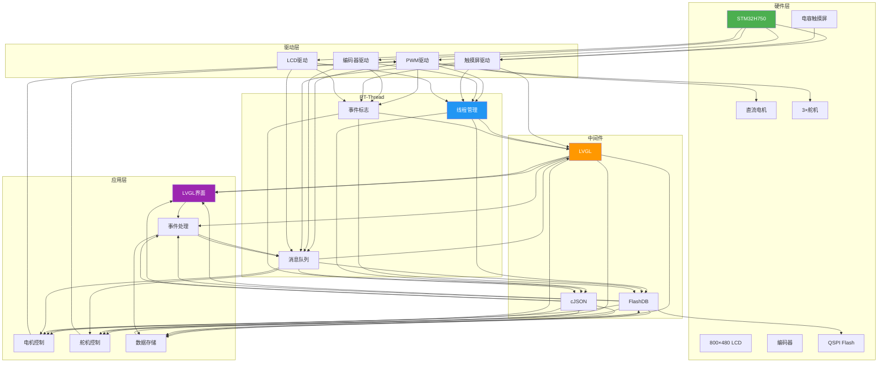

### 2.3.1.2 云端/AI扩展方案

**ESP32-S3智能语音交互扩展**：

| 扩展模块 | 功能 | 通信方式 |
|---------|------|---------|
| ESP32-S3开发板 | 小智AI语音识别、网络连接 | UART6（PC6/PC7） |
| 麦克风 | 语音输入 | I2S/模拟输入 |
| 扬声器 | 语音反馈 | PWM/DAC |

**扩展架构图**：

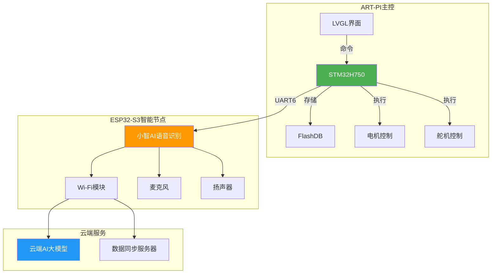

**通信协议（JSON格式）**：

```json
{
    "type": "command",
    "action": "get_component",
    "params": {
        "type": "Resistor",
        "val": "10k",
        "pkg": "0603"
    }
}
```

**ESP32-S3与ART-PI交互流程**：

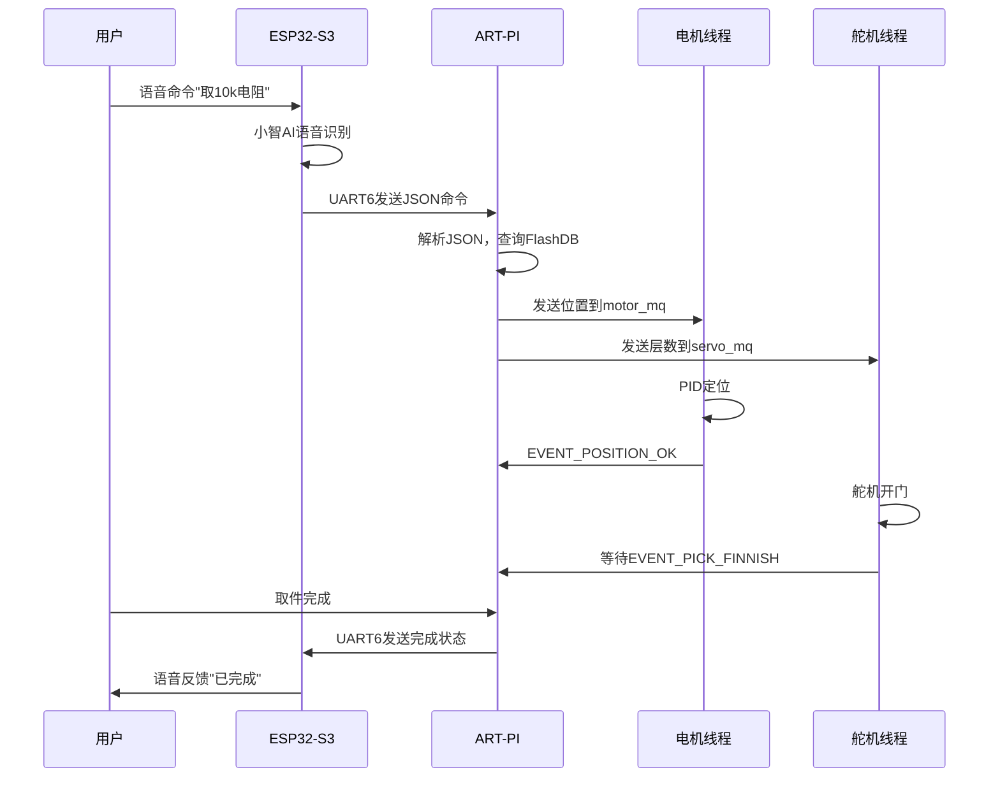

---

## 2.3.2 软件各模块介绍

### 2.3.2.1 主控模块（main.c）

#### 模块概述

主控模块是系统的入口，负责初始化所有子模块、创建全局事件标志、启动系统主循环。

#### 模块流程图

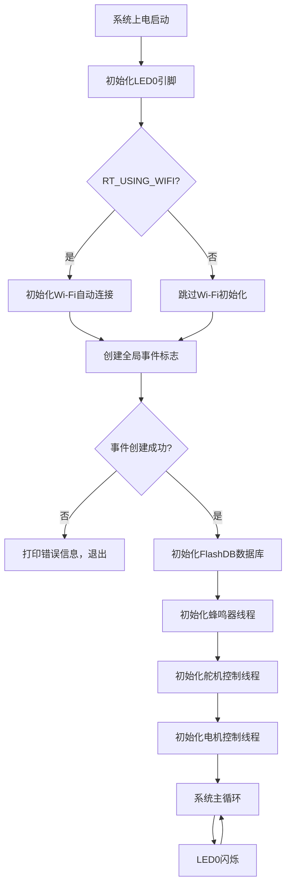

#### 关键函数说明

**main()** - 系统主函数

| 项目 | 说明 |
|------|------|
| **函数签名** | `int main(void)` |
| **输入参数** | 无 |
| **输出/返回值** | `int` - 0表示正常退出 |
| **核心逻辑** | 初始化硬件和软件模块，创建全局事件标志，启动子线程，进入主循环 |

```mermaid
flowchart TD
    A[main()] --> B[rt_pin_mode(LED0_PIN, OUTPUT)]
    B --> C{RT_USING_WIFI}
    C -->|true| D[wlan_autoconnect_init()]
    C -->|false| E[跳过]
    D --> F[rt_wlan_config_autoreconnect]
    E --> F
    F --> G[rt_event_create]
    G --> H{global_event != NULL?}
    H -->|false| I[rt_kprintf error]
    H -->|true| J[database_init()]
    J --> K[buzzer_thread_init()]
    K --> L[servo_thread_init()]
    L --> M[encoder_thread_init()]
    M --> N[while(1)循环]
    N --> O[rt_pin_write LED0 HIGH]
    O --> P[rt_thread_mdelay 500]
    P --> Q[rt_pin_write LED0 LOW]
    Q --> R[rt_thread_mdelay 500]
    R --> N
```

---

### 2.3.2.2 事件定义模块（pv_event.h）

#### 模块概述

定义全局事件标志位，用于线程间同步通信。

#### 事件定义表

| 事件名称 | 位掩码 | 触发时机 | 用途 |
|---------|--------|---------|------|
| EVENT_PICK_FINNISH | `1 << 2` | 用户完成取件操作 | 通知舵机关门 |
| EVENT_POSITION_OK | `1 << 3` | 电机定位完成 | 通知舵机开门 |
| EVENT_TOUCH_SCREEN | `1 << 4` | 触摸屏被触摸 | 触发蜂鸣器反馈 |
| EVENT_ZERO_OK | `1 << 5` | 电机归零完成 | 通知系统就绪 |

---

### 2.3.2.3 电机控制模块（encoder_motor.c）

#### 模块概述

电机控制模块负责直流电机的PID闭环控制，实现精确定位到目标位置，并支持电机归零功能。

#### 模块流程图

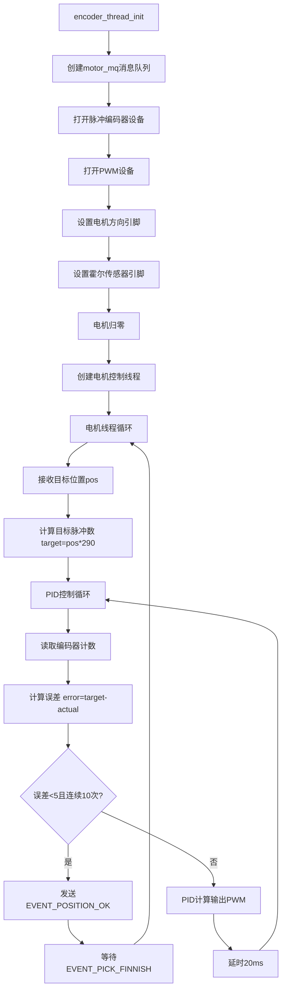

#### 关键函数说明

**encoder_thread_init()** - 电机线程初始化

| 项目 | 说明 |
|------|------|
| **函数签名** | `void encoder_thread_init(void)` |
| **输入参数** | 无 |
| **输出/返回值** | 无 |
| **核心逻辑** | 创建消息队列、打开编码器和PWM设备、初始化引脚、执行归零、创建控制线程 |

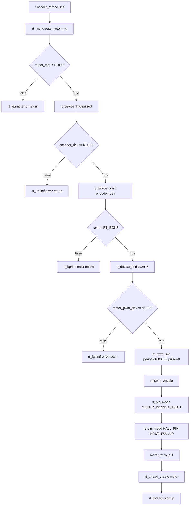

**encodermotor_entry()** - 电机PID控制线程

| 项目 | 说明 |
|------|------|
| **函数签名** | `void encodermotor_entry(void *parameter)` |
| **输入参数** | `parameter` - 线程参数（未使用） |
| **输出/返回值** | 无 |
| **核心逻辑** | 接收目标位置，执行PID闭环控制，定位完成后发送事件标志 |

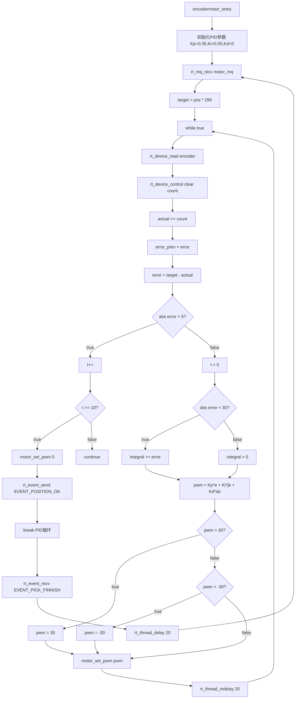

**motor_set_pwm()** - 设置电机PWM输出

| 项目 | 说明 |
|------|------|
| **函数签名** | `void motor_set_pwm(int32_t pwm_val)` |
| **输入参数** | `pwm_val` - PWM值（-100~100，正负表示方向） |
| **输出/返回值** | 无 |
| **核心逻辑** | 根据PWM值设置电机方向和脉冲宽度 |

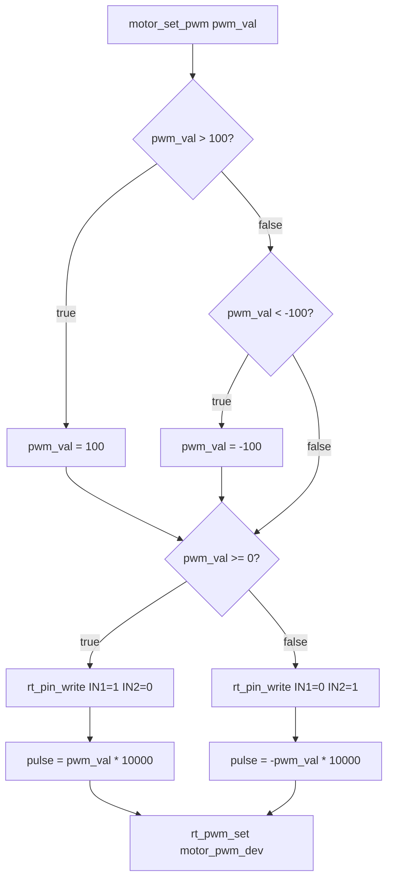

**motor_zero_out()** - 电机归零

| 项目 | 说明 |
|------|------|
| **函数签名** | `void motor_zero_out(void)` |
| **输入参数** | 无 |
| **输出/返回值** | 无 |
| **核心逻辑** | 控制电机转动，检测霍尔传感器上升沿实现归零 |

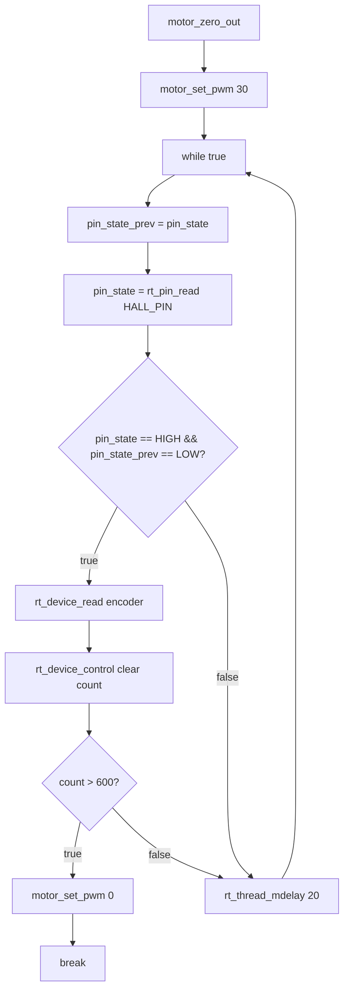

---

### 2.3.2.4 舵机控制模块（servo.c）

#### 模块概述

舵机控制模块负责控制3个SG90舵机，根据目标层数打开/关闭对应的取件门。

#### 模块流程图

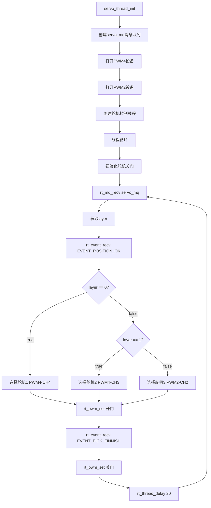

#### 关键函数说明

**servo_thread_init()** - 舵机线程初始化

| 项目 | 说明 |
|------|------|
| **函数签名** | `void servo_thread_init(void)` |
| **输入参数** | 无 |
| **输出/返回值** | 无 |
| **核心逻辑** | 创建消息队列、打开PWM设备、创建控制线程 |

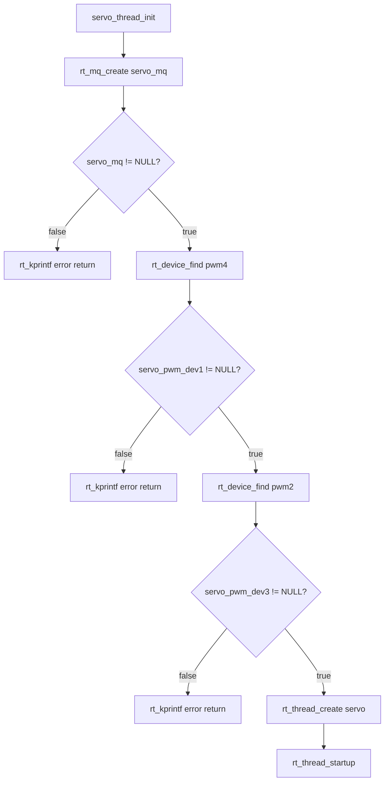

**servo_trhread_entry()** - 舵机控制线程

| 项目 | 说明 |
|------|------|
| **函数签名** | `void servo_trhread_entry(void *parameter)` |
| **输入参数** | `parameter` - 线程参数（未使用） |
| **输出/返回值** | 无 |
| **核心逻辑** | 接收层数信息，等待电机定位完成，控制对应舵机开门/关门 |

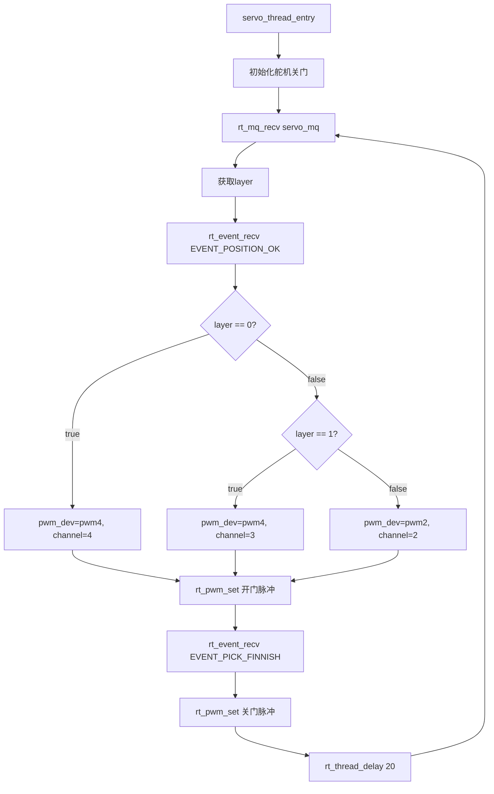

---

### 2.3.2.5 数据存储模块（database.c）

#### 模块概述

数据存储模块基于FlashDB实现键值存储，管理器件信息的添加、查找和更新。

#### 模块流程图

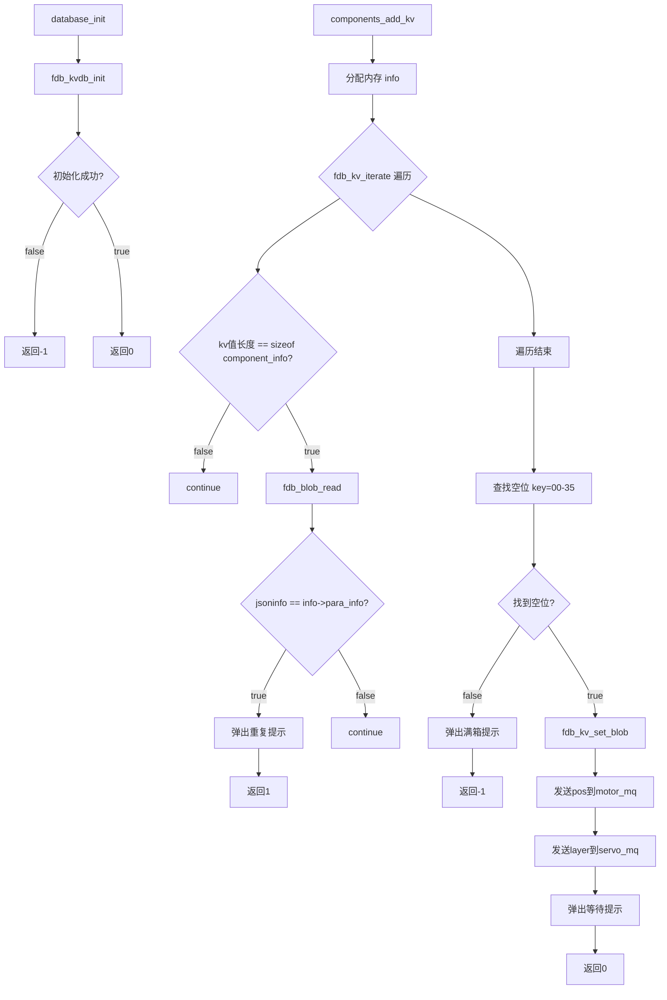

#### 关键函数说明

**database_init()** - 数据库初始化

| 项目 | 说明 |
|------|------|
| **函数签名** | `int database_init(void)` |
| **输入参数** | 无 |
| **输出/返回值** | `int` - 0表示成功，-1表示失败 |
| **核心逻辑** | 初始化FlashDB键值数据库 |

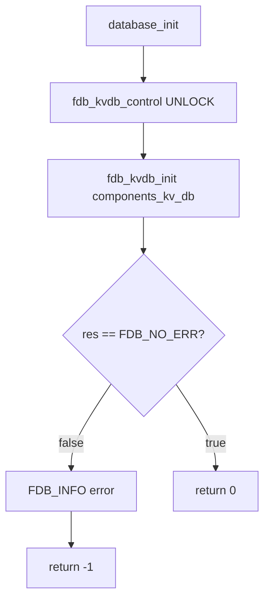

**components_add_kv()** - 添加器件

| 项目 | 说明 |
|------|------|
| **函数签名** | `int components_add_kv(char *jsoninfo, uint32_t quantity)` |
| **输入参数** | `jsoninfo` - JSON格式的器件信息，`quantity` - 器件数量 |
| **输出/返回值** | `int` - 0成功，1重复，-1失败 |
| **核心逻辑** | 遍历数据库检查重复，找到空位后存储器件信息 |

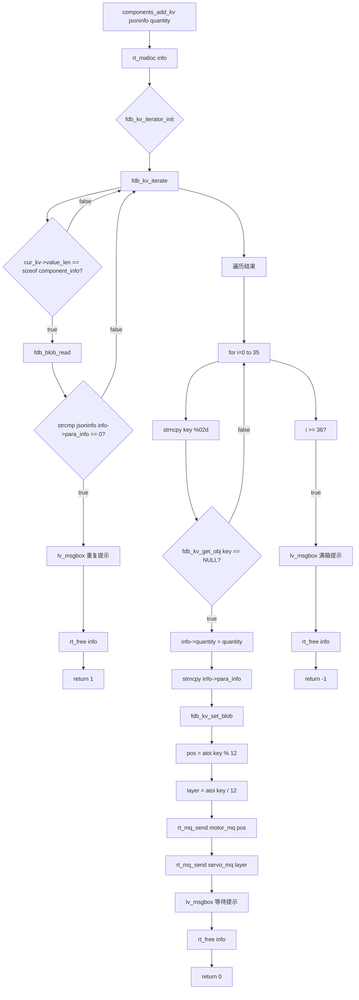

**components_find_kv()** - 查找器件

| 项目 | 说明 |
|------|------|
| **函数签名** | `int components_find_kv(filter_info_t filter)` |
| **输入参数** | `filter` - 筛选条件结构指针 |
| **输出/返回值** | `int` - 0表示成功 |
| **核心逻辑** | 根据筛选条件遍历数据库，匹配的器件添加到界面列表 |

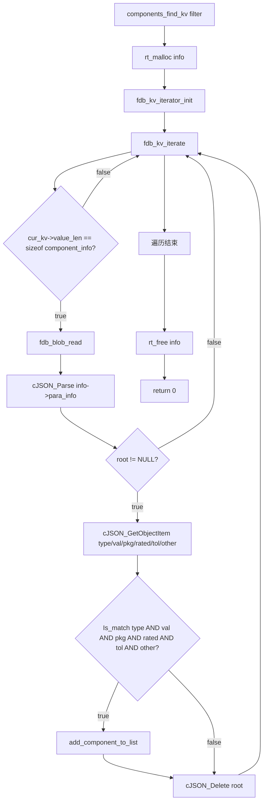

---

### 2.3.2.6 蜂鸣器模块（buzzer.c）

#### 模块概述

蜂鸣器模块负责触摸屏幕时发出声音反馈，提升用户交互体验。

#### 模块流程图

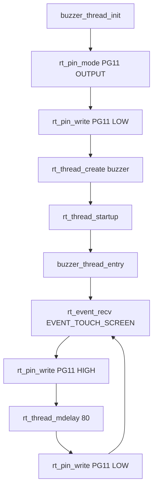

#### 关键函数说明

**buzzer_thread_init()** - 蜂鸣器线程初始化

| 项目 | 说明 |
|------|------|
| **函数签名** | `void buzzer_thread_init(void)` |
| **输入参数** | 无 |
| **输出/返回值** | 无 |
| **核心逻辑** | 设置蜂鸣器引脚为输出模式，创建蜂鸣器控制线程 |

**buzzer_thread_entry()** - 蜂鸣器控制线程

| 项目 | 说明 |
|------|------|
| **函数签名** | `void buzzer_thread_entry(void *parameter)` |
| **输入参数** | `parameter` - 线程参数（未使用） |
| **输出/返回值** | 无 |
| **核心逻辑** | 等待触摸事件，触发蜂鸣器发声80ms |

---

### 2.3.2.7 GUI事件处理模块（ui_events.c）

#### 模块概述

GUI事件处理模块负责处理LVGL界面的用户交互事件，包括添加器件、查找器件、取件操作等。

#### 模块流程图

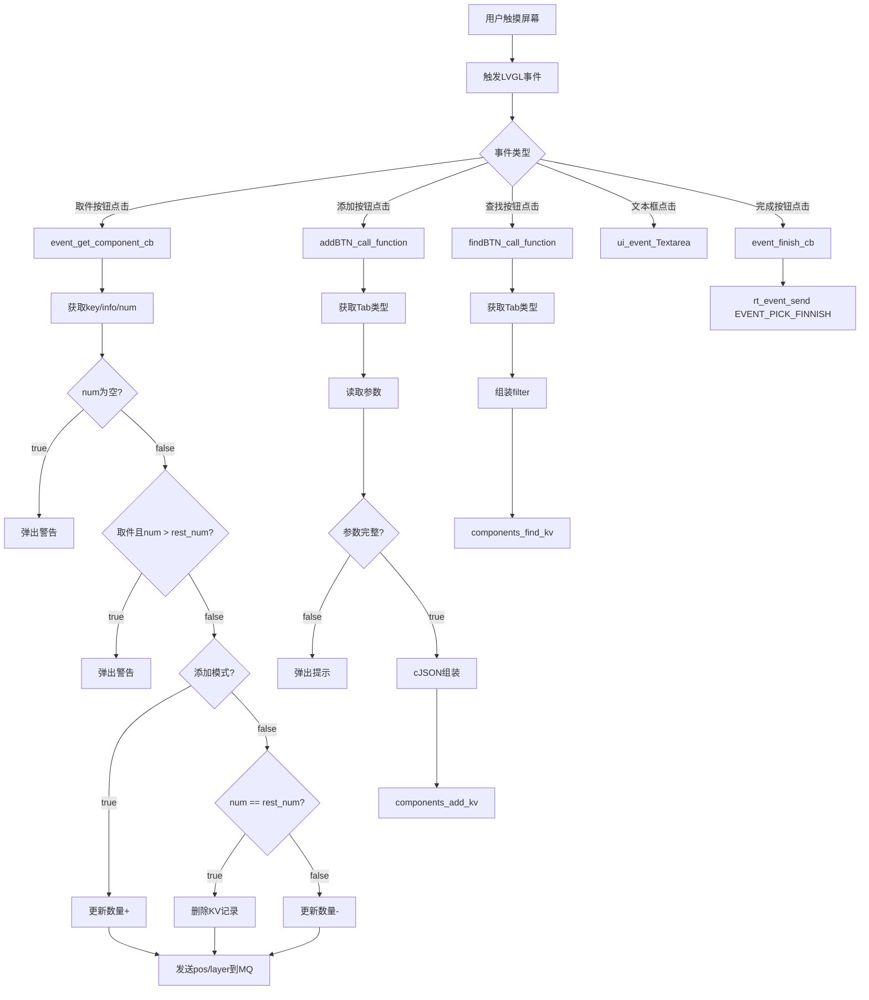

#### 关键函数说明

**event_get_component_cb()** - 取件操作处理

| 项目 | 说明 |
|------|------|
| **函数签名** | `void event_get_component_cb(lv_event_t *e)` |
| **输入参数** | `e` - LVGL事件结构体指针 |
| **输出/返回值** | 无 |
| **核心逻辑** | 获取器件信息和数量，更新数据库，发送位置指令 |

```mermaid
flowchart TD
    A[event_get_component_cb] --> B[screen_touch_function]
    B --> C{event_code == CLICKED?}
    C -->|false| D[return]
    C -->|true| E[获取key_label/info_label/restnum_label]
    E --> F[获取num_textarea]
    F --> G{numtext[0] == '\0'?}
    G -->|true| H[lv_msgbox 警告]
    H --> I[return]
    G -->|false| J[num = atoi numtext]
    J --> K{!add_switch AND num > rest_num?}
    K -->|true| L[lv_msgbox 警告]
    L --> M[return]
    K -->|false| N{add_switch == CHECKED?}
    N -->|true| O[refreshinfo.quantity += num]
    N -->|false| P{num == rest_num?}
    P -->|true| Q[fdb_kv_del]
    Q --> R[lv_obj_del_async]
    P -->|false| S[refreshinfo.quantity -= num]
    O --> T[fdb_kv_set_blob]
    S --> T
    R --> U[pos = atoi key % 12]
    T --> U
    U --> V[layer = atoi key / 12]
    V --> W[rt_mq_send motor_mq pos]
    W --> X[rt_mq_send servo_mq layer]
    X --> Y[lv_msgbox 等待提示]
```

**addBTN_call_function()** - 添加器件处理

| 项目 | 说明 |
|------|------|
| **函数签名** | `void addBTN_call_function(lv_event_t *e)` |
| **输入参数** | `e` - LVGL事件结构体指针 |
| **输出/返回值** | 无 |
| **核心逻辑** | 获取Tab类型和参数，组装JSON数据，调用数据库添加函数 |

```mermaid
flowchart TD
    A[addBTN_call_function] --> B[current_tab = lv_tabview_get_tab_act]
    B --> C{cJSON_CreateObject}
    C --> D{current_tab == RESISTOR?}
    D -->|true| E[读取电阻参数]
    D -->|false| F{current_tab == CAPACITOR?}
    F -->|true| G[读取电容参数]
    F -->|false| H[读取电感参数]
    E --> I[cJSON_AddString type=Resistor]
    G --> J[cJSON_AddString type=Capacitor]
    H --> K[cJSON_AddString type=Inductor]
    I --> L{参数完整?}
    J --> L
    K --> L
    L -->|false| M[lv_msgbox 提示]
    M --> N[cJSON_Delete]
    N --> O[return]
    L -->|true| P[cJSON_AddString val/pkg/rated/accuracy/other]
    P --> Q[cJSON_PrintUnformatted]
    Q --> R[components_add_kv]
    R --> S[cJSON_free]
    S --> T[cJSON_Delete]
```

**findBTN_call_function()** - 查找器件处理

| 项目 | 说明 |
|------|------|
| **函数签名** | `void findBTN_call_function(lv_event_t *e)` |
| **输入参数** | `e` - LVGL事件结构体指针 |
| **输出/返回值** | 无 |
| **核心逻辑** | 获取Tab类型和筛选条件，调用数据库查找函数 |

```mermaid
flowchart TD
    A[findBTN_call_function] --> B[current_tab = lv_tabview_get_tab_act]
    B --> C[lv_obj_clean ui_refreshPanel]
    C --> D[rt_malloc filter]
    D --> E[memset filter 0]
    E --> F{current_tab == RESISTOR?}
    F -->|true| G[strcpy type=Resistor]
    F -->|false| H{current_tab == CAPACITOR?}
    H -->|true| I[strcpy type=Capacitor]
    H -->|false| J[strcpy type=Inductor]
    G --> K[filter->val/package/ratedval/tolerance/otherinfo = 控件文本]
    I --> K
    J --> K
    K --> L[components_find_kv]
    L --> M[rt_free filter]
```

**event_finish_cb()** - 完成按钮处理

| 项目 | 说明 |
|------|------|
| **函数签名** | `void event_finish_cb(lv_event_t *e)` |
| **输入参数** | `e` - LVGL事件结构体指针 |
| **输出/返回值** | 无 |
| **核心逻辑** | 用户点击完成按钮时，发送EVENT_PICK_FINNISH事件 |

```mermaid
flowchart TD
    A[event_finish_cb] --> B{event_code == VALUE_CHANGED?}
    B -->|false| C[return]
    B -->|true| D{lv_msgbox_get_active_btn == 0?}
    D -->|false| E[return]
    D -->|true| F[rt_event_send EVENT_PICK_FINNISH]
    F --> G[lv_msgbox_close]
```

---

## 附录：函数I/O变量汇总表

### 电机控制模块

| 函数名 | 输入参数 | 输出/返回值 | 关键变量 |
|--------|---------|------------|---------|
| `encoder_thread_init` | 无 | 无 | motor_mq, encoder_dev, motor_pwm_dev |
| `encodermotor_entry` | parameter (void*) | 无 | pos, target, error, pwm, Kp, Ki, Kd |
| `motor_set_pwm` | pwm_val (int32_t) | 无 | pulse, IN1, IN2 |
| `motor_zero_out` | 无 | 无 | count, pin_state |

### 舵机控制模块

| 函数名 | 输入参数 | 输出/返回值 | 关键变量 |
|--------|---------|------------|---------|
| `servo_thread_init` | 无 | 无 | servo_mq, servo_pwm_dev1, servo_pwm_dev3 |
| `servo_thread_entry` | parameter (void*) | 无 | layer, pwm_dev, channel, open_pwm, close_pwm |

### 数据存储模块

| 函数名 | 输入参数 | 输出/返回值 | 关键变量 |
|--------|---------|------------|---------|
| `database_init` | 无 | int (0/-1) | components_kv_db |
| `components_add_kv` | jsoninfo (char*), quantity (uint32_t) | int (0/1/-1) | info, key, pos, layer |
| `components_find_kv` | filter (filter_info_t) | int (0/-1) | info, cur_kv, cJSON对象 |

### GUI事件处理模块

| 函数名 | 输入参数 | 输出/返回值 | 关键变量 |
|--------|---------|------------|---------|
| `event_get_component_cb` | e (lv_event_t*) | 无 | key, info, num, pos, layer |
| `addBTN_call_function` | e (lv_event_t*) | 无 | current_tab, val, package, ratedval, cJSON对象 |
| `findBTN_call_function` | e (lv_event_t*) | 无 | current_tab, filter |
| `event_finish_cb` | e (lv_event_t*) | 无 | EVENT_PICK_FINNISH |

### 蜂鸣器模块

| 函数名 | 输入参数 | 输出/返回值 | 关键变量 |
|--------|---------|------------|---------|
| `buzzer_thread_init` | 无 | 无 | BUZZER_PIN |
| `buzzer_thread_entry` | parameter (void*) | 无 | EVENT_TOUCH_SCREEN |

---

**文档版本**：V1.0  
**创建日期**：2026-06-29  
**项目类型**：嵌入式智能存储系统  
**运行平台**：ART-PI (STM32H750) + RT-Thread