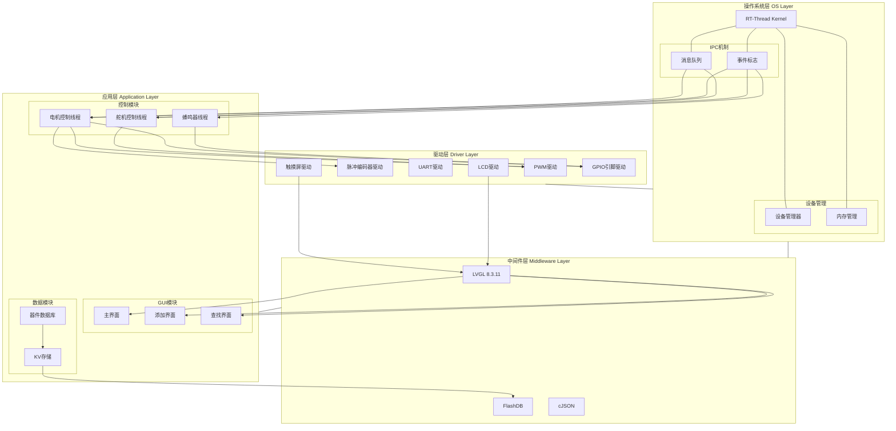
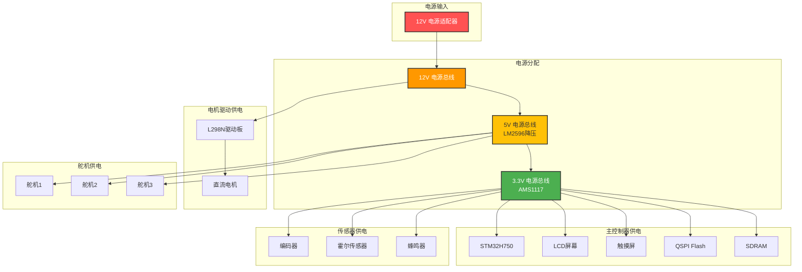
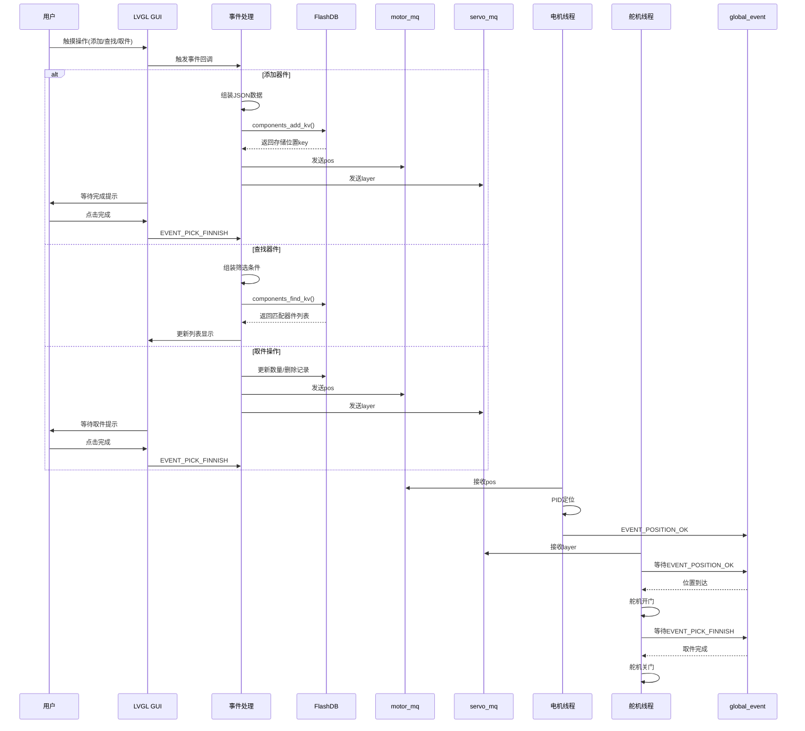
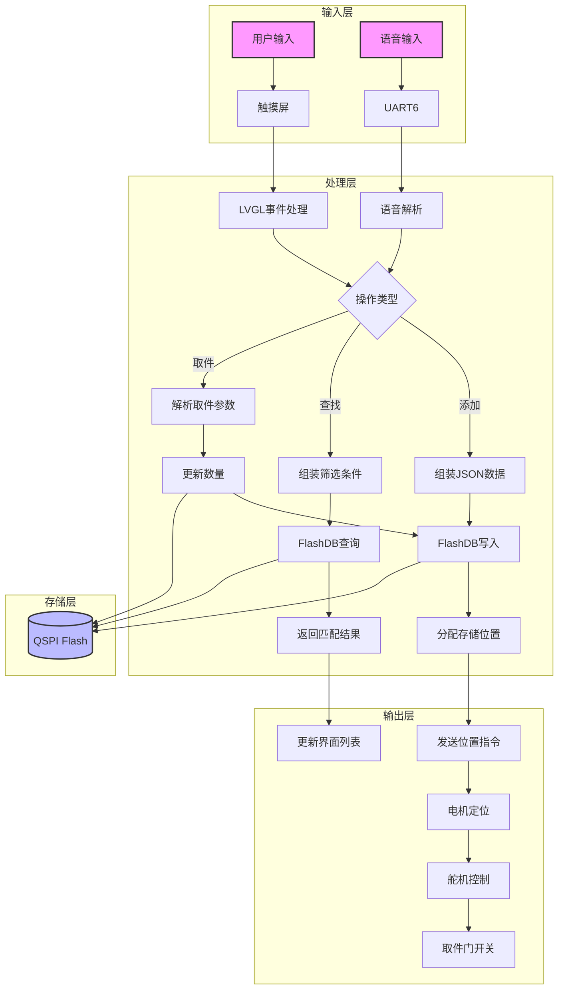
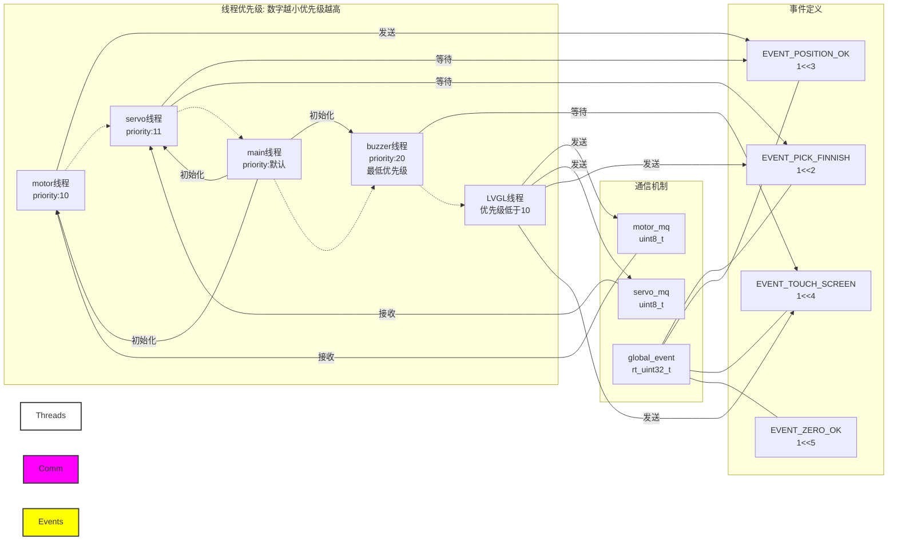
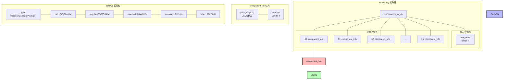
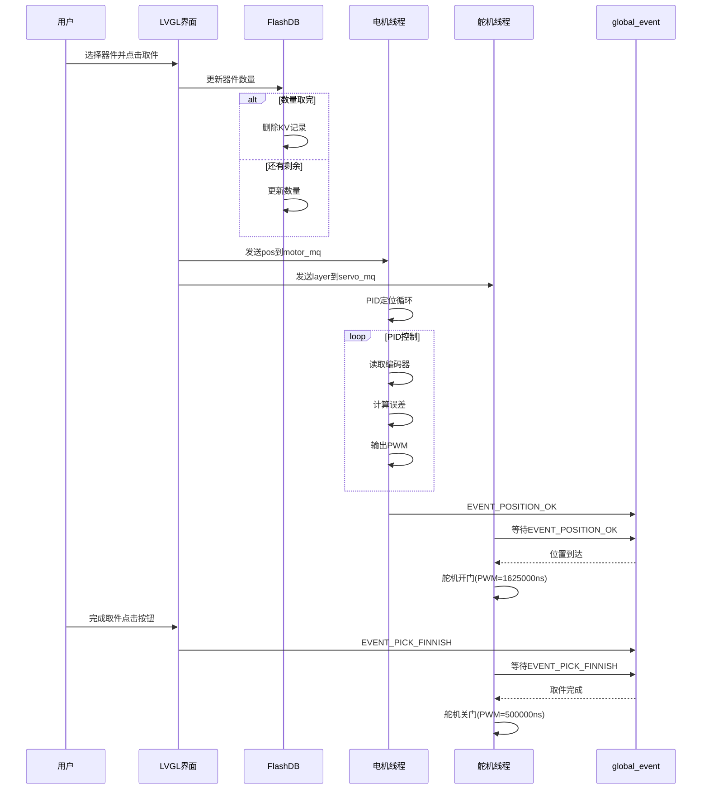
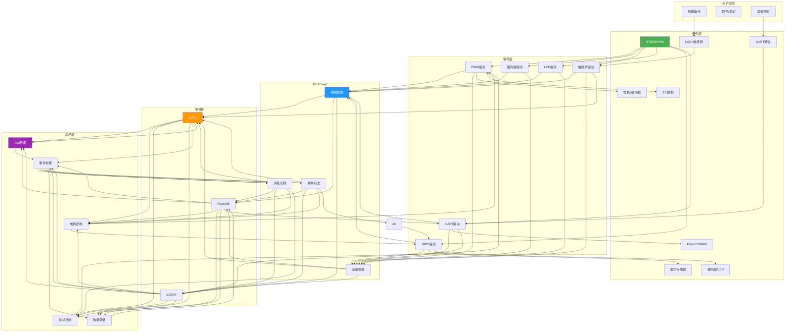

# 智能器件存储盒 - 系统整体框架图

---

## 一、硬件架构图

```mermaid
graph TB
    subgraph ART-PI开发板[ART-PI开发板]
        MCU[STM32H750XBHX<br/>Cortex-M7 @ 480MHz]
        
        subgraph 存储单元
            Flash[QSPI Flash 16MB<br/>0x90000000]
            SRAM[AXI SRAM 512KB<br/>0x24000000]
            SDRAM[SDRAM 32MB<br/>0xC0000000]
        end
        
        subgraph 人机交互外设
            LCD[800×480 TFT LCD]
            Touch[电容触摸屏]
            Buzzer[蜂鸣器 PG11]
            LED[LED0 PI8]
        end
        
        subgraph 通信接口
            UART1[UART1 PA9/PA10]
            UART4[UART4 PA0/PI9]
            UART6[UART6 PC6/PC7]
        end
        
        MCU --- Flash
        MCU --- SRAM
        MCU --- SDRAM
        MCU --- LCD
        MCU --- Touch
        MCU --- Buzzer
        MCU --- LED
        MCU --- UART1
        MCU --- UART4
        MCU --- UART6
    end
    
    subgraph 外部执行机构
        Motor[直流电机]
        Encoder[脉冲编码器 pulse3]
        Hall[霍尔传感器 PA15]
        Servo1[舵机1 PWM4-CH4]
        Servo2[舵机2 PWM4-CH3]
        Servo3[舵机3 PWM2-CH2]
    end
    
    subgraph 预留扩展模块
        Voice[语音模块]
        Wifi[Wi-Fi模块]
    end
    
    MCU --- Motor
    MCU --- Encoder
    MCU --- Hall
    MCU --- Servo1
    MCU --- Servo2
    MCU --- Servo3
    UART6 --- Voice
    
    style MCU fill:#4CAF50,color:#fff,stroke:#333,stroke-width:2px
    style ART-PI开发板 fill:#e3f2fd,stroke:#2196F3,stroke-width:2px
    style 外部执行机构 fill:#fff3e0,stroke:#FF9800,stroke-width:2px
    style 预留扩展模块 fill:#f3e5f5,stroke:#9C27B0,stroke-width:2px
```



---

## 二、软件架构图



---

## 三、电源架构图



---

## 四、软件模块交互图



---

## 五、数据流程图



---

## 六、线程调度与通信图

> **RT-Thread优先级说明**：数字越小优先级越高（priority:10 > priority:11 > priority:20）



---

## 七、硬件连接示意图

```mermaid
graph TB
    subgraph ART-PI开发板
        MCU[STM32H750]
        
        subgraph 板载外设
            LCD[LCD屏幕]
            Touch[触摸屏]
            Flash[QSPI Flash]
            SDRAM[32MB SDRAM]
        end
        
        subgraph 扩展接口
            PWM15["PWM15-CH2<br/>PH2/PH3"]
            PWM4["PWM4-CH3/CH4<br/>PB8/PB9"]
            PWM2["PWM2-CH2<br/>PA7"]
            Encoder["pulse3<br/>编码器"]
            Hall["PA15<br/>霍尔传感器"]
            Buzzer["PG11<br/>蜂鸣器"]
            LED["PI8<br/>LED0"]
            UART6["PC6/PC7<br/>UART6"]
        end
        
        MCU --- LCD
        MCU --- Touch
        MCU --- Flash
        MCU --- SDRAM
    end
    
    subgraph 外部设备
        Motor[直流电机<br/>+ L298N驱动]
        Servo1[舵机1]
        Servo2[舵机2]
        Servo3[舵机3]
        EncoderDev[编码器]
        HallDev[霍尔传感器]
        BuzzerDev[蜂鸣器]
        Voice[语音模块<br/>(预留)]
    end
    
    PWM15 --- Motor
    Encoder --- EncoderDev
    Hall --- HallDev
    PWM4 --- Servo1
    PWM4 --- Servo2
    PWM2 --- Servo3
    Buzzer --- BuzzerDev
    UART6 --- Voice
    
    style MCU fill:#4CAF50,color:#fff,stroke:#333,stroke-width:2px
    style ART-PI开发板 fill:#e3f2fd,stroke:#2196F3,stroke-width:2px
    style 外部设备 fill:#fff3e0,stroke:#FF9800,stroke-width:2px
```

---

## 八、存储架构图



---

## 九、取件流程时序图



---

## 十、系统整体架构全景图



---

**文档版本**：V1.1  
**创建日期**：2026-06-29  
**项目类型**：嵌入式智能存储系统  
**运行平台**：ART-PI (STM32H750) + RT-Thread